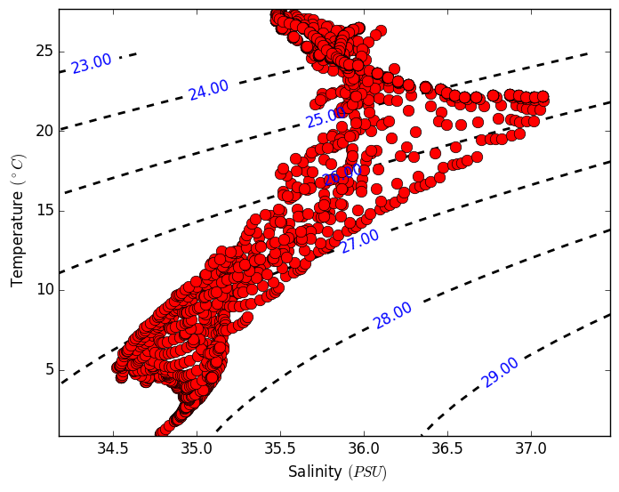

TEMPERATURE - SALINITY DIAGRAM
==============================

Given temperature (T, in degree C), absolute salinity (S, in PSU), and seawater
pressure level, `tsdiagram` handle the inputs and plot the so called TS-diagram
often used in ocean sciences.

Temperature and salinity fields must be of the same size, either in form of 1D
or 2D numpy array. The pressure level is scalar.

Requirements:
-------------
`numpy`
    *For handling array numerics*
`matplotlib`
    *For plotting utilities*
`gsw`: Gibbs SeaWater Oceanographic Package of TEOS-10
    *For seawater equation of state. Mainly used here to calculate the absolute
    density.*

